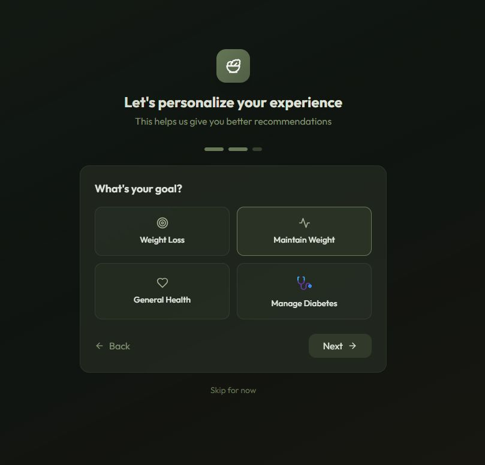
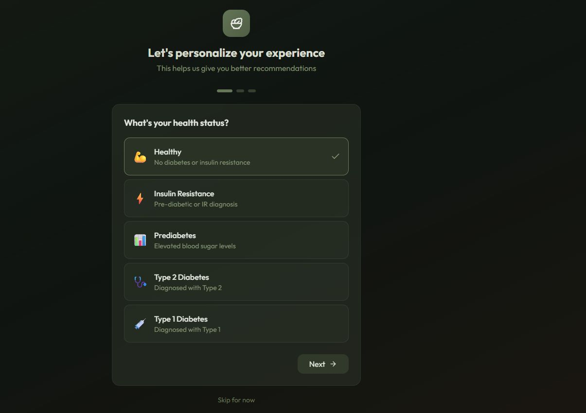
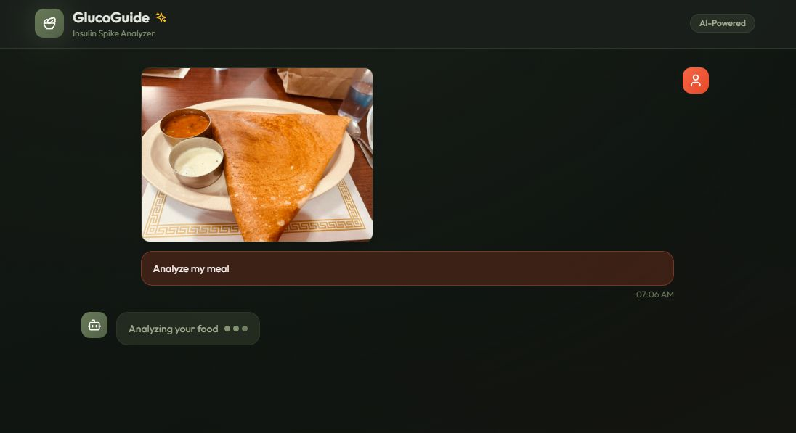
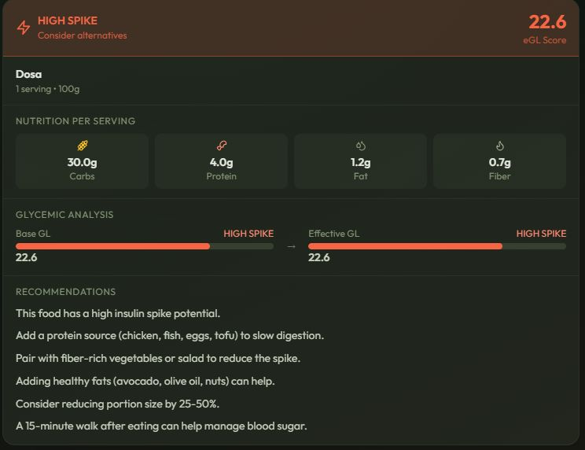
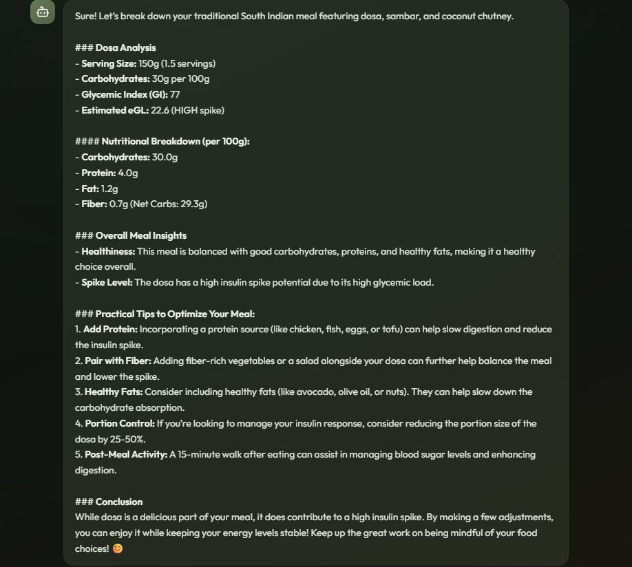
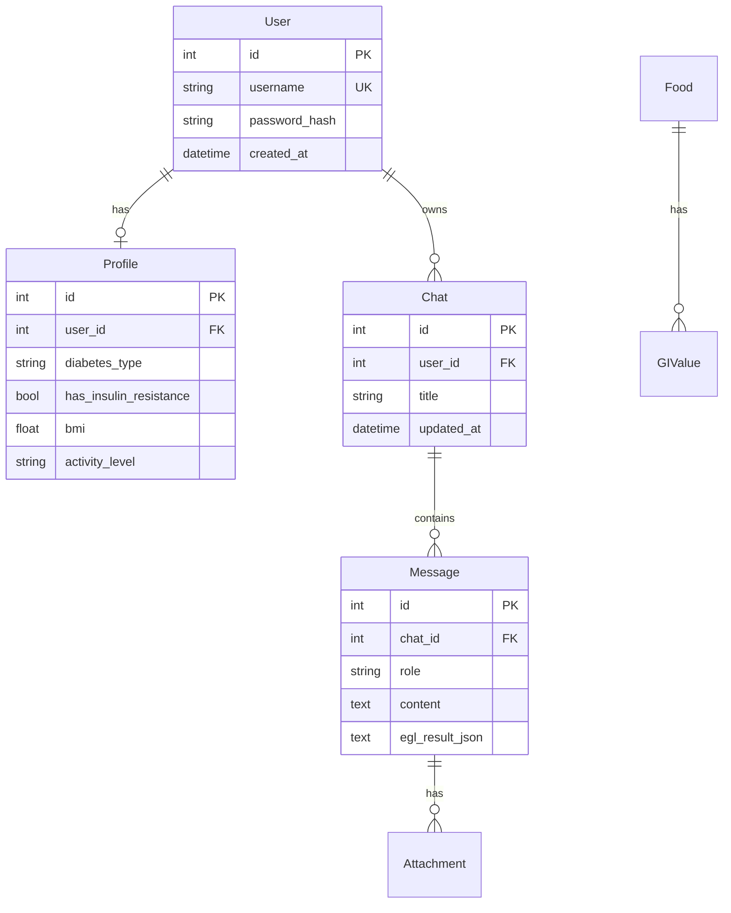

# 🥗 GlucoGuide - Insulin Spike Management Chatbot

An AI-powered chatbot that analyzes food images and calculates the Effective Glycemic Load (eGL) to help health-conscious users understand their food's impact on insulin levels. Now with user accounts, persistent chat history, and personalized recommendations based on individual health profiles.


## ✨ Features

### Core Features
- **🖼️ Food Image Recognition**: Upload food photos for AI-powered identification (GPT-4 Vision)
- **📊 Glycemic Analysis**: Calculate Base GL and Effective GL (eGL)
- **🧮 Macronutrient Modifiers**: Protein, fat, and fiber impact calculations
- **💡 Smart Recommendations**: Personalized tips to reduce insulin spikes
- **💬 Chat Interface**: Natural conversation about nutrition

### New in v2.0
- **👤 User Accounts**: Secure registration and login with bcrypt password hashing
- **💾 Chat History**: Save and revisit all your food analyses with sidebar navigation
- **🖼️ Image Storage**: Uploaded food photos are preserved with chat history
- **🎯 User Profiles**: Health status tracking (healthy, insulin resistance, diabetes type 1/2, prediabetes)
- **📈 Risk Score Engine**: Profile-adjusted insulin spike predictions
- **🏥 Personalized Warnings**: Diabetes/IR-specific recommendations and warnings
- **🔬 USDA Integration**: Access to comprehensive nutritional data from USDA FoodData Central
- **📥 GI Import Pipeline**: CSV-based import system for expanding the GI database

## 🎯 How It Works

### Effective Glycemic Load (eGL) Calculation

1. **Base GL** = (GI × Net Carbs) / 100
2. **Macronutrient Modifiers Applied**:
   - Fiber: Up to 20% reduction
   - Protein: Up to 20% reduction  
   - Fat: Up to 15% reduction
3. **eGL** = Base GL × (1 - modifiers)
4. **Profile Adjustment** (if logged in):
   - Insulin resistance: +15-30% risk increase
   - Type 2 diabetes: +20% risk increase
   - Activity level: -15% to +10% adjustment
   - A1C levels: +10-20% for elevated values
   - Medications (metformin, GLP-1): -10-15% reduction

### Spike Classification

**For General Users:**
| eGL Range | Level | Guidance |
|-----------|-------|----------|
| 0-10 | LOW | ✅ Safe to eat freely |
| 11-19 | MODERATE | ⚠️ Eat in moderation |
| 20+ | HIGH | ❌ Limit or mitigate |

**For Diabetic Users (adjusted thresholds):**
| Risk Score | Level | Guidance |
|------------|-------|----------|
| 0-8 | MINIMAL | ✅ Safe choice |
| 9-15 | LOW | ✅ Good with monitoring |
| 16-25 | MODERATE | ⚠️ Pair with protein/fiber |
| 26-35 | HIGH | ⚠️ Small portions only |
| 36+ | VERY HIGH | ❌ Avoid or discuss with doctor |

## 🚀 Quick Start

### Prerequisites

- Python 3.10+
- Node.js 18+
- OpenAI API Key
- USDA API Key (optional, default key provided)

### Backend Setup

```bash
cd backend

# Create virtual environment
python -m venv venv

# Activate virtual environment
# On Windows:
venv\Scripts\activate
# On macOS/Linux:
source venv/bin/activate

# Install dependencies
pip install -r requirements.txt

# Create .env file
cp .env.example .env
# Fill in OPENAI_API_KEY and USDA_API_KEY (secret keys) in backend/.env

# Run the server
python main.py
```

#### Secrets / `.env` locations

- **Local development**: `backend/.env` (loaded by `python-dotenv` when running the backend from `backend/`)
- **Production (systemd)**: `deploy/.env` (loaded via `EnvironmentFile` in `deploy/glucospike.service`)

Do not commit real secret values.

The API will be available at `http://localhost:8000`

**On first run**, the database will auto-initialize and seed with 80+ foods.

### Frontend Setup

```bash
cd frontend

# Install dependencies
npm install

# Run development server
npm run dev
```

The app will be available at `http://localhost:5173`

## Deployment

See `deployment.md`.

## 📁 Project Structure

```
insulin_spike_management/
├── backend/
│   ├── main.py                 # FastAPI application with routers
│   ├── app.db                  # SQLite database (auto-created)
│   ├── requirements.txt        # Python dependencies
│   ├── database/
│   │   ├── __init__.py
│   │   └── gi_database.py      # In-memory GI & nutrition data
│   ├── db/                     # SQLite persistence layer
│   │   ├── __init__.py
│   │   ├── engine.py           # Database engine & session
│   │   ├── models.py           # SQLAlchemy models (Users, Profiles, Chats, etc.)
│   │   └── seed_data.py        # Initial data seeding
│   ├── routes/                 # API route handlers
│   │   ├── auth.py             # Registration, login, logout
│   │   ├── chats.py            # Chat CRUD, messages, image upload
│   │   ├── profile.py          # User profile & onboarding
│   │   └── usda.py             # USDA FoodData Central integration
│   ├── services/
│   │   ├── egl_calculator.py   # eGL calculation + risk scoring
│   │   ├── food_analyzer.py    # OpenAI Vision integration
│   │   └── usda_service.py     # USDA API client
│   ├── scripts/
│   │   └── import_gi_csv.py    # GI data import utility
│   ├── models/
│   │   ├── __init__.py
│   │   └── schemas.py          # Pydantic API models
│   └── uploads/                # User-uploaded images
│
├── frontend/
│   ├── package.json
│   ├── vite.config.ts
│   ├── tailwind.config.js
│   ├── index.html
│   └── src/
│       ├── App.tsx             # Main app with auth & chat routing
│       ├── main.tsx            # Entry point
│       ├── index.css           # Global styles
│       ├── types.ts            # TypeScript types
│       ├── api.ts              # API client (auth, chats, profiles)
│       ├── context/
│       │   └── AuthContext.tsx # Authentication context
│       ├── pages/
│       │   ├── Login.tsx       # Login page
│       │   ├── Register.tsx    # Registration page
│       │   └── Onboarding.tsx  # Profile setup wizard
│       └── components/
│           ├── Header.tsx
│           ├── Sidebar.tsx     # Chat history sidebar
│           ├── ChatMessage.tsx
│           ├── ChatInput.tsx
│           ├── EGLResultCard.tsx
│           ├── WelcomeScreen.tsx
│           └── LoadingMessage.tsx
│
├── initial_plan.txt            # Original project planning
├── customization_1.txt         # Customization requirements
├── customization_2.txt         # Profile & risk scoring specs
└── README.md
```

## 🔌 API Endpoints

### Authentication
| Method | Endpoint | Description |
|--------|----------|-------------|
| POST | `/api/auth/register` | Create new user account |
| POST | `/api/auth/login` | Login with username/password |
| POST | `/api/auth/logout` | Logout and clear session |
| GET | `/api/auth/me` | Get current user info |
| GET | `/api/auth/check` | Check authentication status |

### Chat History
| Method | Endpoint | Description |
|--------|----------|-------------|
| GET | `/api/chats` | List user's chats |
| POST | `/api/chats` | Create new chat |
| GET | `/api/chats/{id}` | Get chat with messages |
| PATCH | `/api/chats/{id}` | Update chat title |
| DELETE | `/api/chats/{id}` | Delete chat |
| POST | `/api/chats/{id}/messages` | Add message to chat |
| POST | `/api/chats/{id}/image` | Upload image to chat |
| GET | `/api/chats/uploads/{user_id}/{chat_id}/{filename}` | Serve uploaded image |

### User Profile
| Method | Endpoint | Description |
|--------|----------|-------------|
| GET | `/api/profile` | Get user profile |
| PUT | `/api/profile` | Update profile |
| POST | `/api/profile/onboarding` | Complete onboarding |
| GET | `/api/profile/summary` | Get profile summary for risk calc |

### Food Analysis
| Method | Endpoint | Description |
|--------|----------|-------------|
| POST | `/api/analyze/image` | Analyze food image |
| POST | `/api/analyze/food` | Analyze food by name |
| GET | `/api/foods/search` | Search food database |
| GET | `/api/foods` | List all foods |
| GET | `/api/foods/categories` | List food categories |
| POST | `/api/chat` | General chat (legacy) |

### USDA Integration
| Method | Endpoint | Description |
|--------|----------|-------------|
| GET | `/api/usda/search` | Search USDA FoodData Central |
| GET | `/api/usda/food/{fdc_id}` | Get detailed food data |
| GET | `/api/usda/test` | Test USDA API connection |

## 🗄️ Database Schema

The app uses SQLite with the following tables:

- **users**: User accounts with bcrypt-hashed passwords
- **profiles**: Health profiles (diabetes type, insulin resistance, BMI, activity, goals, etc.)
- **chats**: Chat sessions per user
- **messages**: Individual messages with optional eGL/food analysis JSON
- **attachments**: Uploaded images linked to messages
- **foods**: Cached food data from USDA
- **gi_values**: GI values from multiple sources with confidence levels
- **sessions**: Server-side session storage

## 🍎 Sample Foods in Database

- **Grains**: Rice (white, brown, basmati), pasta, bread, oatmeal, quinoa
- **Fruits**: Apple, banana, orange, mango, berries, watermelon, grapes
- **Vegetables**: Potato, sweet potato, broccoli, carrots, spinach, corn, peas
- **Proteins**: Chicken, salmon, eggs, tofu, beef, tuna
- **Legumes**: Lentils, chickpeas, black beans, kidney beans
- **Dairy**: Milk, yogurt, Greek yogurt, cheese, paneer
- **Indian Foods**: Chapati, roti, naan, dosa, idli, dal, biryani, paratha, samosa
- **Meals**: Pizza, burger, sandwich, fried rice, sushi, salad
- **Snacks**: Chips, popcorn, cookies, cake, chocolate, ice cream
- **Nuts**: Almonds, walnuts, peanuts, cashews
- **And 80+ more foods...**

## 💡 Tips for Best Results

1. **Create an account** to unlock chat history and personalized recommendations
2. **Complete onboarding** to get tailored advice based on your health status
3. **Take clear photos** with good lighting
4. **Include the whole plate** for accurate portion estimation
5. **Ask follow-up questions** about specific foods
6. **Combine high-GL foods** with protein and fiber

## 🔐 Environment Variables

Create a `.env` file in the backend directory:

```env
# Required
OPENAI_API_KEY=your_openai_api_key_here

# Optional (default key provided)
USDA_API_KEY=6iX9Wx9gJXL1QSzLhfdhIkGE4bDK3lfwWgvL50RS
```

## 📊 Expanding the Database

### Import GI Data from CSV

```bash
cd backend

# Create sample CSV
python -m scripts.import_gi_csv --sample

# Import from CSV
python -m scripts.import_gi_csv path/to/gi_data.csv "Source Name"

# Export current data
python -m scripts.import_gi_csv --export
```

**CSV Format:**
```csv
food_name,gi,source,source_url,confidence,notes
apple,36,University of Sydney,https://glycemicindex.com,high,Raw with skin
banana,51,University of Sydney,https://glycemicindex.com,high,Ripe
```

### Search USDA Database

The app can search USDA FoodData Central for nutritional data:
- Visit: `http://localhost:8000/api/usda/test` to test connection
- Use the `/api/usda/search?q=chicken` endpoint to find foods
- Nutritional data is automatically cached in SQLite

## 🏥 Health Profiles

Users can set their health status during onboarding:

- **Healthy**: Standard eGL calculations for general fitness
- **Insulin Resistance**: +15-25% risk adjustment, additional pairing tips
- **Prediabetes**: +15% risk adjustment, prevention-focused recommendations
- **Type 2 Diabetes**: +20% risk adjustment, blood sugar monitoring reminders
- **Type 1 Diabetes**: Carb counting guidance, insulin dosing considerations

### Profile Factors

The risk score considers:
- BMI (body mass index calculated from height/weight)
- Activity level (sedentary to very active)
- A1C levels (HbA1c percentage)
- Diabetes duration
- Current medications (metformin, GLP-1 agonists, etc.)
- Age

## 🎨 User Interface

### Login & Registration
- Secure authentication with password requirements
- Session-based auth with httpOnly cookies
- Clean, modern dark UI

### Chat History Sidebar
- Create multiple chats for different meals/occasions
- Search through past conversations
- Rename or delete chats
- Collapsible sidebar for focused view

### Profile Onboarding
- 3-step wizard for quick setup
- Health status, goals, activity level
- Skip option for immediate access

## 📸 App Screenshots

| Onboarding (Goals) | Onboarding (Health Status) |
|---|---|
|  |  |

| Chat (Analyze Meal) | Result (High Spike) |
|---|---|
|  |  |



## 💻 Development

### Backend Technologies
- **FastAPI**: Modern Python web framework
- **SQLAlchemy**: ORM for database operations
- **aiosqlite**: Async SQLite driver
- **bcrypt**: Password hashing
- **OpenAI API**: GPT-4 Vision for food recognition
- **USDA FoodData Central**: Nutritional data

### Frontend Technologies
- **React 18**: UI framework
- **TypeScript**: Type safety
- **Tailwind CSS**: Styling
- **Framer Motion**: Animations
- **Vite**: Build tool

### Database Structure



## 🧪 Testing the App

1. **Register a new account**: Username and password (6+ characters)
2. **Complete onboarding**: Select health status, goals, activity level
3. **Upload a food photo**: Click camera icon or image upload
4. **View results**: See eGL calculation with personalized risk score
5. **Check chat history**: All conversations saved in the sidebar

## 📚 Data Sources

### Glycemic Index Sources
1. University of Sydney GI Database (glycemicindex.com)
2. Harvard Health Publications
3. American Diabetes Association
4. Manual curation from research papers

### Macronutrient Data Sources
1. USDA FoodData Central (primary - comprehensive nutrition data)
2. Manual database (80+ common foods with verified data)

## 🔧 Advanced Usage

### Running Database Migrations

```bash
cd backend
python -c "from db.seed_data import seed_foods_and_gi; import asyncio; asyncio.run(seed_foods_and_gi())"
```

### Testing USDA Integration

```bash
curl http://localhost:8000/api/usda/test
curl "http://localhost:8000/api/usda/search?q=chicken&limit=5"
```

### Backup Chat History

The SQLite database (`backend/app.db`) contains all user data. Back it up regularly:

```bash
cp backend/app.db backend/app.db.backup
```

## 🔒 Security Features

- **bcrypt password hashing**: Industry-standard password security
- **httpOnly cookies**: Prevents XSS attacks
- **Session expiry**: 7-day sessions with automatic cleanup
- **User isolation**: Users can only access their own chats and data
- **File access control**: Uploaded images only accessible by owner

## 📈 Roadmap

- [ ] Export chat history to PDF
- [ ] Meal planning with GL budgets
- [ ] Progress tracking over time
- [ ] Mobile app version
- [ ] Integration with continuous glucose monitors (CGM)
- [ ] Recipe GL calculator
- [ ] Social sharing of healthy meals

## 🐛 Troubleshooting

### Backend won't start
- Ensure Python 3.10+ is installed: `python --version`
- Check if port 8000 is available
- Verify OPENAI_API_KEY is set in `.env`

### Frontend won't start
- Ensure Node.js 18+ is installed: `node --version`
- Delete `node_modules` and run `npm install` again
- Check if port 5173 is available

### Database issues
- Delete `backend/app.db` to reset (you'll lose all data)
- Check file permissions on `backend/app.db`

### OpenAI quota errors
- Check your OpenAI account credits at platform.openai.com
- The app gracefully handles API failures

## 📝 License

MIT License - feel free to use and modify!

## 🤝 Contributing

Contributions are welcome! Please feel free to submit a Pull Request.

### Areas for Contribution
- Additional food data sources
- More GI values from research
- Improved risk scoring algorithms
- UI/UX enhancements
- Mobile responsiveness
- Internationalization

---

**Note**: This application is for educational purposes only and should not be considered medical advice. Always consult with a healthcare professional for personalized nutrition guidance, especially if you have diabetes or other health conditions.

**Target Audience**: Non-diabetic individuals, people with insulin resistance, and diabetic patients who want to make informed food choices. The app provides different recommendations based on your health profile.
